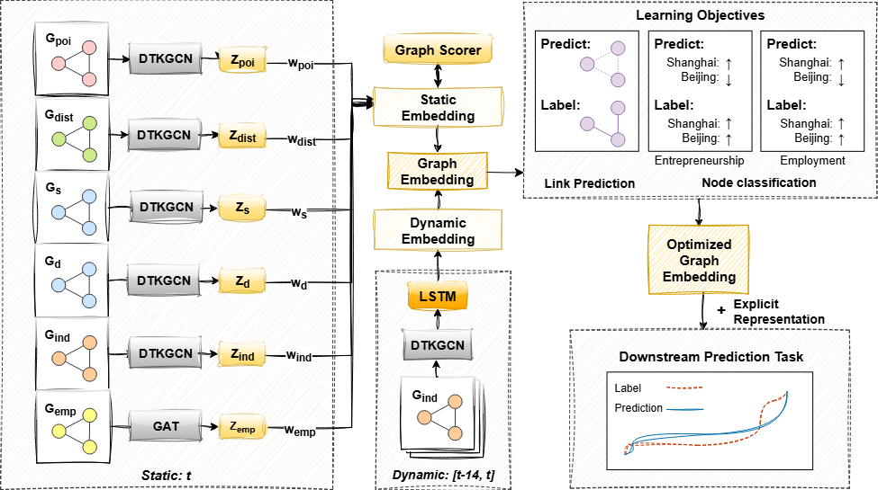

# ECO-GROW: Embedding of Cities through Optimized Graph Representation Of Weighted neighbors

## Abstract
Urban economic vitality is a crucial indicator of a city’s long-term growth potential, comprising key metrics such as the annual number of new companies and the population employed. However, modeling urban economic vitality remains challenging. This study develops ECO-GROW, a multi-graph framework modeling China's inter-city networks (2005-2021) to generate urban embeddings that model urban economic vitality. Traditional approaches relying on static city-level aggregates fail to capture a fundamental dynamic: the developmental trajectory of one city today may mirror that of its structurally similar counterparts tomorrow. ECO-GROW overcomes this limitation by integrating industrial linkages, POI similarities, migration similarities and temporal network evolution over 15 years. The framework combines a Dynamic Top-K GCN to adaptively select influential inter-city connections and an adaptive Graph Scorer mechanism to dynamically weight cross-regional impacts. Additionally, the model incorporates a link prediction task based on Barabasi Proximity, optimizing the graph representation. Experimental results demonstrate ECO-GROW's superior accuracy in predicting entrepreneurial activities and employment trends compared to conventional models. By open-sourcing our code, we equip researchers and policymakers to anticipate emerging business hubs through network analogies and design targeted policies.

## Key Features


- Multi-view graph learning
- Dynamic temporal pattern extraction using LSTM
- Dynamic Top-k neighbor selection for efficient information aggregation
- Weighted graph fusion for optimal feature combination

## Repository Structure
```
ECO-GROW/
├── Models/
│ ├── main.py # Entry point for training and evaluation
│ ├── model.py # Core model architecture
│ ├── layer.py # Custom GNN layers implementation
│ └── utils.py # Utility functions and data processing
└── requirements.txt # Required Python packages
```

## Requirements
```bash
numpy>=1.21.0
pandas>=1.3.0
tqdm>=4.62.0
matplotlib>=3.4.0
torch>=1.9.0
torch-geometric>=2.0.0
torch-scatter>=2.0.9
torch-sparse>=0.6.12
scikit-learn>=0.24.2
networkx>=2.6.0
```

## Installation
```bash
# Clone the repository
git clone https://github.com/yourusername/ECO-GROW.git
cd ECO-GROW

# Create virtual environment (recommended)
python -m venv venv
source venv/bin/activate  # Linux/Mac
# or
venv\Scripts\activate  # Windows

# Install dependencies
pip install -r requirements.txt
```

## Model Architecture
ECO-GROW consists of three main components:
1. **Static Graph Module**
   - Processes multiple city relationship graphs
   - Uses attention mechanism for graph importance weighting
   - Implements dynamic top-k neighbor selection for efficient computation

2. **Dynamic Graph Module**
   - Captures temporal patterns using LSTM
   - Processes time-series graph data
   - Generates dynamic city embeddings

3. **Fusion Module**
   - Combines static and dynamic features
   - Applies residual connections
   - Generates final predictions

## Usage
### Training
```bash
python Models/main.py \
    --file_name ECO-GROW \
    --layer_name TKGCN \
    --loss_name BCE \
    --alpha 0.6 \
    --beta 0.5 \
    --num_epochs 250 \
    --lr 0.01 \
```

### Main Parameters
- `file_name`: Name of the experiment
- `layer_name`: Type of GNN layer (TKGCN/AllGCN)
- `loss_name`: Loss function type
- `alpha`: Weight parameter for loss combination
- `beta`: Weight parameter for loss combination
- `weight_decay`: L2 regularization parameter
- `num_epochs`: Number of training epochs
- `num_layer`: Number of GNN layers
- `lr`: Learning rate
- `dropout_rate`: Dropout probability
- `device`: Computing device (cuda/cpu)

## File Descriptions

### Models/main.py
- Entry point for model training
- Command-line argument parsing
- Training process initialization

### Models/model.py
- `ECO_GROW`: Main model class
- Implements static and dynamic graph processing
- Handles feature fusion and prediction

### Models/layer.py
- `TKGCN`: GCN layer with dynamic top-k neighbor selection
- `AttentionLayer`: Self-attention mechanism

### Models/utils.py
- Data loading and preprocessing
- Evaluation metrics calculation
- Training utilities and helper functions

## Results
The model outputs:
- Node embeddings for each city
- Graph importance scores
- Prediction results and evaluation metrics
- Visualization of results

## Citation
If you use this code for your research, please cite our paper:
```bibtex
@article{eco-grow2024,
  title={Tracing Footsteps of Similar Cities: Forecasting Regional Entrepreneurship with Dynamic Inter-City Graph Embeddings},
  author={Your Name},
  journal={},
  year={2024}
}
```

## License
This project is licensed under the MIT License.

## Contact
For any questions or issues, please open an issue or contact [xxx].
# ECO_GROW
